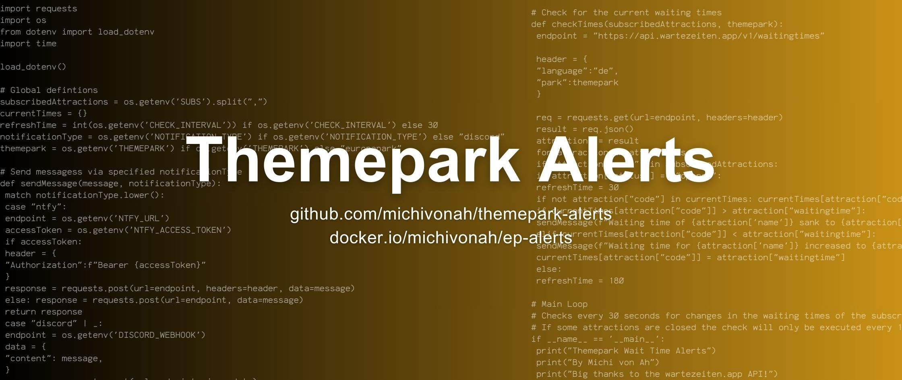

# Themepark Wait Time Alerts

A tool which alerts you when the waiting times of subscribed attractions in your favourite themepark sinks or increase. The notifications are sent to a Discord webhook or to your ntfy-server. Powered by the [wartezeiten.app](https://www.wartezeiten.app/page/api.html) API.

GitHub: https://github.com/michivonah/themepark-alerts <br>
Docker: https://hub.docker.com/r/michivonah/ep-alerts

Host it on your own server:
1. Install docker on your system

    ```apt-get install docker.io docker-compose -y```
2. Run container (don't forget to change your discord webhook url)

    ```docker run -d --name ep-alerts --env DISCORD_WEBHOOK="https://discord.com/api/webhooks/XXXXXXXXXXXXXX/YYYYYYYYYYYYYYYYYYYYYYYYY" --env SUBS=383533,323530,353030 michivonah/ep-alerts```

## Enviormental variables
These environment variables are supported

| Variable | Description | Example | Required |
| --- | --- | --- | --- |
| NOTIFICATION_TYPE | Define which type of notification you want use. Supported are: discord, ntfy | ``discord`` | yes |
| CHECK_INTERVAL | Defines how often the API is requested and the waittimes are checked for updates (in seconds) | ``30`` | no |
| DISCORD_WEBHOOK | The URL of your discord webhook | ``https://discord.com/api/webhooks/XXXXXXXXXXXXXX/YYYYYYYYYYYYYYYYYYYYYYYYY`` | no* |
| NTFY_URL | The URL to your ntfy topic | ``https://ntfy.example.com/mytopic`` | no* |
| NTFY_ACCESS_TOKEN | Optional access token for authenticating against your ntfy server if authentication is enabled. | ``tk_2cdbcfea1702cc3bd2c874beab1`` | no |
| SUBS | Your subscribed attractions with ID from wartezeiten.app API | ``383533,323530,353030`` | yes |
| THEMEPARK | Select your desired themepark from the wartezeiten.app API. Defaults to ``europapark`` | ``europapark`` | no |


> *Depending on the selected service for notifications (``NOTIFICATION_TYPE``) ether ``DISCORD_WEBHOOK`` or ``NTFY_URL`` is required.